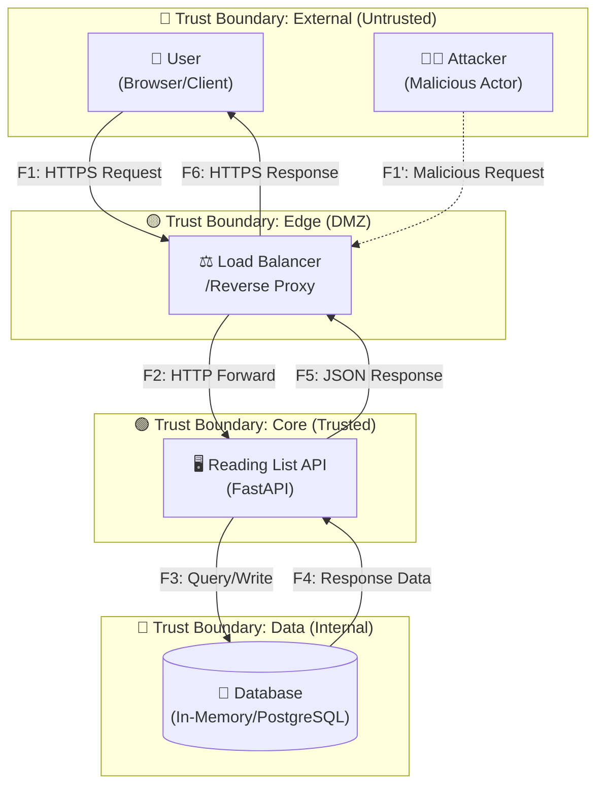
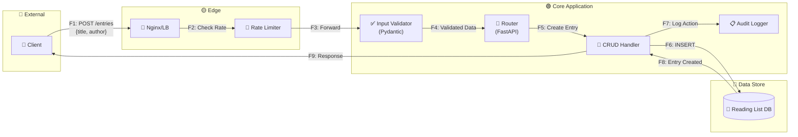

# Data Flow Diagram (DFD) — Reading List API

## Обзор

Данный документ содержит диаграмму потоков данных (DFD) для сервиса Reading List API с отмеченными границами доверия (Trust Boundaries).

---

## Контекстная диаграмма (Level 0)

---

## Детальная диаграмма (Level 1) — API Processing

---

## Описание потоков данных

| ID | Поток | Источник | Назначение | Протокол | Данные | Trust Boundary Crossing |
|----|-------|----------|------------|----------|--------|------------------------|
| **F1** | Client Request | User/Client | Load Balancer | HTTPS/TLS 1.3 | JSON (title, author, status, notes) | External → Edge |
| **F2** | Forward Request | Load Balancer | API Server | HTTP (internal) | JSON + Headers | Edge → Core |
| **F3** | Database Query | API Server | Database | Internal | SQL/ORM Query | Core → Data |
| **F4** | Database Response | Database | API Server | Internal | Entry Records | Data → Core |
| **F5** | API Response | API Server | Load Balancer | HTTP (internal) | JSON Response | Core → Edge |
| **F6** | Client Response | Load Balancer | User/Client | HTTPS/TLS 1.3 | JSON Response | Edge → External |
| **F7** | Audit Log | CRUD Handler | Logger | Internal | Action metadata | Core (internal) |

---

## Границы доверия (Trust Boundaries)

| Граница | Уровень доверия | Описание | Контроли на границе |
|---------|-----------------|----------|---------------------|
| **🔴 External** | Untrusted (0) | Внешние пользователи, потенциальные атакующие | TLS, Rate Limiting |
| **🟡 Edge (DMZ)** | Semi-trusted (1) | Reverse proxy, балансировщик | WAF, IP filtering |
| **🟢 Core** | Trusted (2) | Бизнес-логика приложения | Input validation, AuthZ |
| **🔵 Data** | Highly-trusted (3) | Хранилище данных | Network isolation, Encryption at rest |

---

## Элементы системы

### Внешние сущности (External Entities)
- **User**: Легитимный пользователь, работающий со списком чтения
- **Attacker**: Потенциальный злоумышленник (для моделирования угроз)

### Процессы (Processes)
- **Load Balancer**: Nginx/Traefik — терминация TLS, балансировка
- **Rate Limiter**: Ограничение запросов (NFR-004)
- **Input Validator**: Pydantic-валидация входных данных (NFR-003)
- **Router**: FastAPI routing и middleware
- **CRUD Handler**: Бизнес-логика работы с записями
- **Audit Logger**: Логирование операций (NFR-007)

### Хранилища данных (Data Stores)
- **Reading List DB**: Хранилище записей (in-memory для dev, PostgreSQL для prod)

---

## История изменений

| Дата | Версия | Автор | Изменения |
|------|--------|-------|-----------|
| 2024-12-09 | 1.0 | Атаханов Н.Р. | Первоначальная версия DFD |
